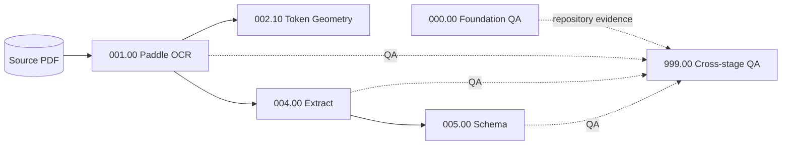

# Numbered ETL DAG

**Status:** Canonical architecture and execution contract  
**Recorded at:** 2026-08-23T08:42:39+08:00  
**Last updated:** 2026-08-23T20:17:55+08:00

This document is the map for `paddle_pdf_ocr_v2`: what each numbered node
consumes, what it produces, which edges exist, and how changes propagate. ADRs
record why decisions changed; this file describes the current operating model.

## Design invariant

The pipeline is a directed acyclic graph of immutable JSON boundaries:

> A numbered node owns one transformation, reads only declared inputs, writes
> only its own directory, and never imports another numbered node.

Python imports are implementation reuse only through `etl/_shared/`. Data moves
between nodes through retained artifacts under `output/<run>/`. A node must not
silently edit an upstream artifact or select an unspecified "latest" layer.

## Current graph and execution order



Equivalent dependency notation:

```text
PDF ──→ 001.00-paddle-ocr ──→ 002.10-token-geometry
                    └────────→ 004.00-extract ──→ 005.00-schema

002.00-layout and 003.00-table-cells are archived comparison scripts only.
004.00-extract does not read their artifacts.

000.00-foundation and stage QA ──→ 999.00-run-qa
```

The active scripts use one fixed topological execution order: 001.00, 002.10,
004.00, 005.00. Extract emits one deterministic page-level fallback zone until
the planned table-structure stage supplies geometry-derived sections.

## Planned graph after extraction

These directory identifiers are reserved, but no executable is created until
the node has an implemented transformation, input/output contract, tests, and
local QA.


The `006.00-rows` boundary is intentionally pre-hierarchy. It lets hierarchy
engines be rebuilt and compared without rerunning OCR, layout, extraction, or
row construction.

## Node registry

| Node | State | Inputs | Primary output | QA owner |
|---|---|---|---|---|
| `000.00-foundation` | Implemented | ETL source and `etl/tests/` | Test records | `000.00-foundation/qa/` |
| `001.00-paddle-ocr` | Implemented | Source PDF pages | Tokens and lines | `001.00-paddle-ocr/qa/` |
| `002.00-layout` | Archived comparison, inactive | Source PDF pages | Model layout proposals | `002.00-layout/qa/` |
| `002.10-token-geometry` | Implemented, measurement-only | 001 tokens | Deterministic bands, gaps, phrases, right-edge groups, and fits | `002.10-token-geometry/qa/` |
| `003.00-table-cells` | Archived comparison, inactive | PDF, 001, archived 002 | Model cell proposals | `003.00-table-cells/qa/` |
| `004.00-extract` | Implemented, model-layout-free | 001 | Canonical page extract with page fallback zone | `004.00-extract/qa/` |
| `005.00-schema` | Implemented | 004 | Per-zone modes, roles, confidence, findings | `005.00-schema/qa/` |
| `006.00-rows` | Reserved | 005 | Canonical pre-hierarchy rows | Local QA required |
| `007.00-domain` | Reserved | 006 | Domain annotations | Local QA required |
| `008.00-hierarchy` | Reserved | 007 | Parent/level structure | Local QA required |
| `009.00-collation` | Reserved | 008 | Cross-page tables/documents | Local QA required |
| `999.00-run-qa` | Reserved | Declared stage QA/artifacts | Cross-stage/run comparisons | Self |

`998.00-*` is reserved for archived, non-executable evidence. It is not part of
the active DAG.

## Numbering

The directory and executable convention is `NNN.II-name`:

- `NNN` is the major pipeline position, `000`–`999`.
- `II` is an insertion position, `00`–`99`.
- `.00` is the normal transformation.
- `.90`–`.99` are reserved for reviewed human-intervention nodes.
- Lexical order communicates intended pipeline order, but dependency edges—not
  numeric proximity—determine execution requirements.

An inserted algorithmic stage may use another available slot such as `.10`.
Human corrections follow [`HUMAN_OVERRIDES.md`](HUMAN_OVERRIDES.md).

## Filesystem contract

Each run is a comparison boundary:

```text
output/<run>/
├── manifest.json
├── viewer.json
├── 001.00-paddle-ocr/
│   ├── pages/page-0008.json
│   └── qa/summary.json
├── 002.00-layout/
│   ├── pages/page-0008.json
│   └── qa/summary.json
├── 002.10-token-geometry/
│   ├── pages/page-0008.json
│   └── qa/summary.json
├── 003.00-table-cells/
│   ├── pages/page-0013.json
│   └── qa/summary.json
└── 004.00-extract/
    ├── pages/page-0008.json
    └── qa/summary.json
```

Page filenames use stable one-based PDF page numbers. JSON is written to a
temporary sibling, flushed, and atomically replaced. Atomicity prevents partial
JSON; it does not by itself prove that an old artifact is compatible with new
inputs.

## Executable ownership

The implementation mirrors the artifact graph:

```text
etl/001.00-paddle-ocr.py  → output/<run>/001.00-paddle-ocr/
etl/002.00-layout.py      → output/<run>/002.00-layout/
etl/002.10-token-geometry.py → output/<run>/002.10-token-geometry/
etl/003.00-table-cells.py → output/<run>/003.00-table-cells/
etl/004.00-extract.py     → output/<run>/004.00-extract/
```

Every numbered executable owns input loading, transformation, diagnostics,
persistence, and QA. Numbered executables do not import each other. Shared code
must have at least two unchanged numbered consumers and is audited by
`etl/tests/test_000_00_dag_contract.py`.

## Test ownership

ETL tests live beside the DAG under `etl/tests/` and mirror their owner:

```text
test_000_00_*  repository, artifact, migration, and DAG contracts
test_001_00_*  Paddle OCR transformation
test_002_00_*  layout transformation
test_003_00_*  table-cell transformation
test_004_00_*  extract assembly
```

The retained foundation command writes every named result to
`output/foundation/000.00-foundation/qa/tests.json` and its rollup to
`summary.json`.

## QA contract

Every implemented node writes `qa/summary.json` containing at least:

- gate and stage name;
- page count and failure count;
- `started_at` and `completed_at` in timezone-aware ISO 8601 seconds;
- monotonic `elapsed_s`;
- `timestamp_source`;
- page-level outcomes and diagnostics; and
- a final `pass` value.

Stage-local QA answers whether that transformation met its contract.
`999.00-run-qa` is only for comparisons spanning stages or runs. Passing unit
tests proves named invariants, not visual or structural fidelity; promotion
also requires retained representative evidence and viewer review.

## Execution and invalidation

`etl/run_etl.py` executes an inclusive slice of the single active order:

```bash
python etl/run_etl.py \
  --pdf-source pdfs/NEP-2027-VOLUME-2B_OCR.pdf \
  --pages "1-2,3,5-7" \
  --start-stage 1 \
  --end-stage 3
```

Page selection is one-based throughout: page 1 is the first PDF page. The
runner expands multiple comma-separated pages and inclusive ranges, so
`1-2,3,5-7` becomes `1,2,3,5,6,7`. It deduplicates and sorts the result before
passing the same one-based pages to every selected ETL script. The original
selection and expanded pages are retained in run QA.

`--pages-json` plus `--pages-obj` load a named page set from a project JSON
file and **override** `--pages`. Supported object shapes include
`migration_gold.json` `edge_pages` (objects with `"page"`) and
`contiguous_spans` (objects with `"pages": "13-20"`). Example:

```bash
python etl/run_etl.py --pdf-source pdfs/NEP-2027-VOLUME-2B_OCR.pdf \
  --pages-json fixtures/migration_gold.json --pages-obj edge_pages --dry-run
```

Major bounds include active insertions: stage range `1` to `3` means keys
`001.00` through `003.99`. An explicit bound such as `2.10` may target an
insertion directly. `--dry-run` prints the ordered slice without creating
output. `--run` selects an existing/new run name; otherwise the PDF stem is
used so smokes and partial stage reruns overwrite the same folder in place.
Pass an explicit distinct `--run` when you need to retain a comparison copy.

### Runner defaults

| Parameter | Default | Reason |
|---|---:|---|
| `--pages` | `1` | Safest bounded smoke; page 1 is the first PDF page |
| `--pages-json` | unset | Optional JSON file of named page sets; overrides `--pages` |
| `--pages-obj` | unset | Object name inside `--pages-json` (required with it) |
| `--start-stage` | `1` | Begin with the first active extraction node |
| `--end-stage` | `5` | Produce the current canonical schema artifact |
| `--run` | PDF stem | Reuse/overwrite the same `output/<stem>/` for smokes and partial reruns |
| `--dpi` | `200` | Reviewed production extraction resolution |
| `--device` | `gpu:0` | Intended production Paddle execution device |
| `--dry-run` | false | Execute unless explicitly inspecting the plan |
| `--allow-storage-overcommit` | false | Override refusal when estimated outputs exceed free disk |

`--pdf-source` has no default because choosing the wrong volume would produce
valid-looking artifacts from the wrong source. The runner prints all resolved
defaults before it launches the first subprocess.

Before execution it also prints a **storage estimate** for retained outputs:
per-page JSON size across selected stages (from `extraction-smoke` averages),
run total, per-stage breakdown, and free space on `output/`. Page count scales
disk use; rasters are not written. If free space is below the estimate plus
512 MiB headroom, the runner refuses to start unless
`--allow-storage-overcommit` is set. `--dry-run` still prints the estimate
without starting stages.

Relative PDF paths resolve against the v2 project first and its parent workspace
second. `gpu:0` is the intended production default and requires
`paddlepaddle-gpu` from Paddle's CUDA index (see README Setup). A CPU-only
`paddlepaddle` wheel falls into a broken oneDNN path (ISS-019);
`ordered-etl-smoke-20260823T0905+0800` is retained as that failure evidence.

Starting after stage 1 is allowed only when the chosen run already contains
compatible upstream artifacts. Automatic compatibility validation is not yet
implemented, so partial runs are an explicit operator responsibility.

When a node's code, settings, source PDF, or upstream artifact changes:

1. write results to a new named run when preserving a reviewed comparison;
2. rerun the changed node;
3. invalidate and rerun every reachable downstream consumer;
4. retain each node's QA; and
5. compare matching numbered paths between runs to locate the first change.

Full automatic fingerprint invalidation and locked reviewed runs are not yet
implemented (ISS-012 and ISS-015). Until then, operators must not interpret an
existing file as compatible merely because its path exists.

## Insertions and defunct stages

`run_etl.py` contains the single explicit `ACTIVE_STAGES` tuple. It does not
discover scripts by filename. An active insertion is added to that tuple in
numeric position and therefore runs automatically when its key falls within
the requested bounds. For example:

```text
001.00 → 001.90-ocr-human-overrides → 002.10
```

A defunct insertion is removed from `ACTIVE_STAGES`; its decision and evidence
remain in history and its script may be retained under `etl/retired/`. Removing,
adding, or reordering any active stage changes the pipeline definition and
requires a new run plus rebuild of every downstream stage. Main `.00` stages
remain stable; a change that alters their ordering is an architectural revision,
not a runtime option.

## Adding a node

A new node is ready only when all of the following exist:

1. a unique `NNN.II-name`, documented incoming/outgoing edges, and an explicit
   position in `run_etl.py::ACTIVE_STAGES`;
2. one matching executable containing the complete transformation;
3. declared input and output artifact schemas;
4. atomic, stage-owned persistence;
5. local QA with retained timing and page/result details;
6. matching numbered tests under `etl/tests/`;
7. viewer support when spatial or structural review is material;
8. manifest and artifact-store registration; and
9. an ADR or issue link for nontrivial architectural behavior.

Do not add placeholder executables for reserved stages.
